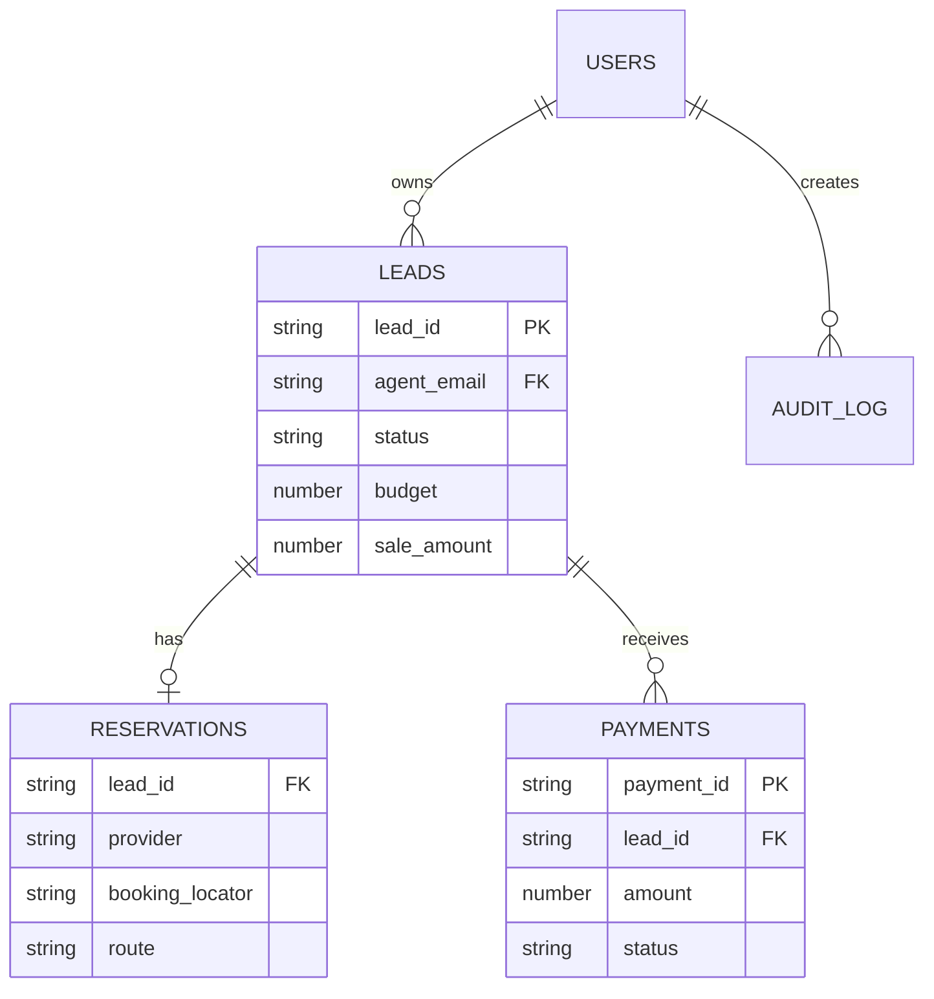
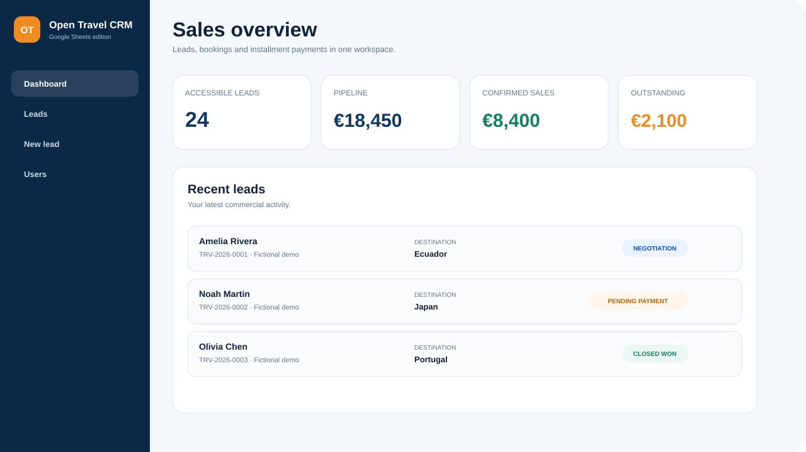

<div align="center">
  

  # Open Travel CRM for Google Sheets

  **A secure, lightweight CRM for travel agencies—built with Google Sheets and Google Apps Script.**

  [Live demo](https://soroushkarahrodi79-oss.github.io/travel-agency-crm-google-sheets/) ·
  [Installation](docs/DEPLOYMENT.md) ·
  [Architecture](docs/ARCHITECTURE.md) ·
  [Security](SECURITY.md) ·
  [Español](README.es.md)

  [](https://github.com/soroushkarahrodi79-oss/travel-agency-crm-google-sheets/actions/workflows/ci.yml)
  [](LICENSE)
  [](https://developers.google.com/apps-script)
  [](https://www.google.com/sheets/about/)
  [](CONTRIBUTING.md)
</div>

## Why this project?

Most small travel agencies start in spreadsheets, then outgrow them before a
full SaaS CRM is financially or operationally justified. Open Travel CRM keeps
the familiar Google Sheets data layer while adding a focused, responsive web
application and server-side access controls.

It is intentionally:

- **deployable in minutes** with Google Apps Script;
- **auditable** because every critical payment action is recorded;
- **portable** because the database remains a spreadsheet you own;
- **dependency-free at runtime**—no database server or frontend build;
- **safe to fork**—the repository contains no real customers or credentials.

## Features

| Area | Included |
| --- | --- |
| Lead management | Search, create, edit, agent ownership, pipeline statuses |
| Travel data | Destination, route, provider, locator, departure and return |
| Sales | Budget, final sale amount, follow-up and next action |
| Installments | Add/edit payments, paid/balance summary, overpayment guard |
| Auditability | Cancel instead of delete, cancellation reason, audit log |
| Security | Email OTP, signed sessions, role/ownership checks, ScriptLock |
| UX | Responsive dashboard, accessible forms, mobile layout |
| Operations | One-command tests, security scan, GitHub Actions |

## Data model



## Quick start

### 1. Create the spreadsheet

Create a blank Google Sheet and copy its ID from the URL.

### 2. Create the Apps Script project

```bash
npm install -g @google/clasp
clasp login
cp .clasp.json.example .clasp.json
```

Create a standalone project at
[`script.google.com`](https://script.google.com/), replace `YOUR_SCRIPT_ID` in
the local `.clasp.json`, then run `clasp push`. The private `.clasp.json` is
ignored by Git.

### 3. Initialize the CRM

In Apps Script **Project Settings → Script Properties**, add:

| Property | Value |
| --- | --- |
| `TRAVEL_CRM_SPREADSHEET_ID` | ID copied from the Google Sheet URL |
| `TRAVEL_CRM_ADMIN_EMAIL` | Email for the first administrator |

Then run `setupTravelCrm_()` from the Apps Script editor. The temporary admin
email property is removed after a successful installation.

The function creates all sheets, headers, formats, validations and the first
administrator account.

### 4. Deploy

Deploy as a Web App:

- **Execute as:** Me (the deployment owner)
- **Who has access:** users with a Google account, or your Workspace domain

Agents sign in with a one-time code sent to an active email in the `USERS`
sheet. They do not need direct access to the spreadsheet.

See the complete [deployment guide](docs/DEPLOYMENT.md) before using real data.

## Screenshots

The [interactive static demo](https://soroushkarahrodi79-oss.github.io/travel-agency-crm-google-sheets/)
uses fictional records and never connects to a spreadsheet.



## Security promises

- No real spreadsheet ID, Script ID, email, token or customer record is stored
  in this repository.
- Agent ownership is always enforced on the server.
- Browser-supplied roles and owners are never trusted.
- One-time codes expire in 10 minutes and signed sessions expire after 8 hours.
- Session tokens are stored in browser session storage and never in the sheet.
- Payments are cancelled, not physically deleted.
- Concurrent writes use a script-level lock.
- Deployment secrets live in Apps Script Properties.

Read [SECURITY.md](SECURITY.md) and the
[threat model](docs/SECURITY_MODEL.md) before production deployment.

## Local quality checks

```bash
npm test
npm run security:scan
```

The checks validate Apps Script syntax, browser JavaScript, required
documentation, manifest scopes and common secret patterns.

## Project status

Version `1.0.0` is a production-minded reference implementation. It is not a
hosted service and does not provide regulatory compliance by itself.

See the [roadmap](ROADMAP.md) for planned integrations and reporting.

## Contributing

Issues, security reviews, documentation improvements and pull requests are
welcome. Start with [CONTRIBUTING.md](CONTRIBUTING.md).

## License

Released under the [MIT License](LICENSE).

Open Travel CRM is an independent project and is not affiliated with Google.
