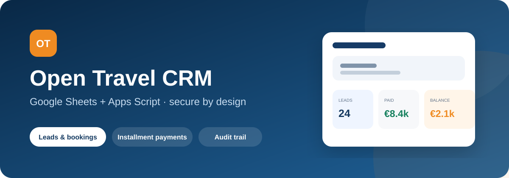
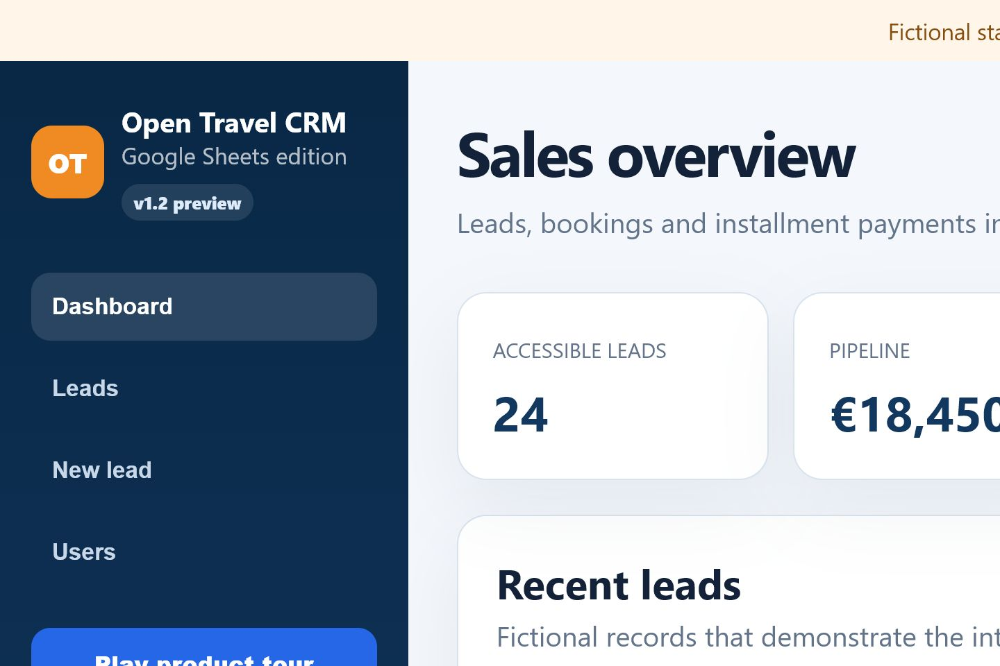
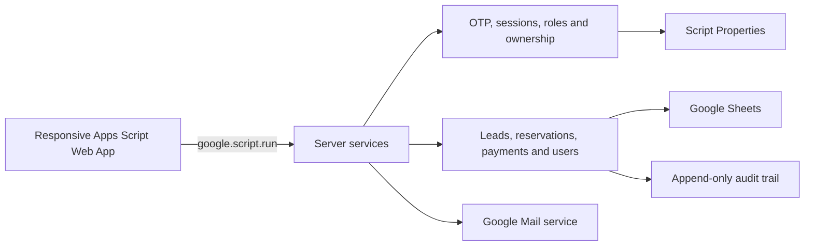

<div align="center">
  

  # Open Travel CRM for Google Sheets

  **A secure, self-hosted CRM for travel agencies that runs on Google Sheets and Apps Script.**

  Own the data. Keep the workflow simple. Deploy without a database server.

  [Try the interactive demo](https://soroushkarahrodi79-oss.github.io/travel-agency-crm-google-sheets/) ·
  [Deploy the CRM](docs/DEPLOYMENT.md) ·
  [Read the architecture](docs/ARCHITECTURE.md) ·
  [Español](README.es.md)

  [](https://github.com/soroushkarahrodi79-oss/travel-agency-crm-google-sheets/actions/workflows/ci.yml)
  [](CHANGELOG.md)
  [](LICENSE)
  [](package.json)
  [](CONTRIBUTING.md)
</div>

## The problem it solves

Small travel teams often live between two uncomfortable choices: an
unstructured spreadsheet or a SaaS CRM that is too expensive, too generic, or
too difficult to customize. Open Travel CRM keeps Google Sheets as the
transparent data layer and adds a focused web application with server-side
authorization, payment controls and an audit trail.

It is designed to be:

- **easy to own** — the agency controls the spreadsheet, Apps Script project and deployment;
- **safe to fork** — no customer records, deployment IDs or credentials are committed;
- **operationally simple** — no database server, frontend build or runtime package installation;
- **configurable** — brand name, currency, locale and time zone are deployment settings;
- **auditable** — payments are cancelled rather than deleted, and sensitive mutations are logged;
- **maintainable** — versioned schema checks, health diagnostics, CI and release consistency checks are included.

## What is included

| Capability | Details |
| --- | --- |
| Lead pipeline | Create, search, filter and assign leads across seven statuses |
| Follow-up queue | Overdue, today and next-seven-day views ordered by urgency |
| Balance reporting | Outstanding balances aged against departure, exportable to CSV |
| Languages | Spanish and English interface and errors, selected by deployment locale |
| Travel operations | Destination, provider, booking locator, route, travel dates and passengers |
| Commercial tracking | Budget, final sale, follow-up date, next action and conversion metrics |
| Installments | Add and edit payments, calculate balances and block overpayment |
| Financial consistency | Prevent sale totals below collected payments; keep lead status aligned with balance |
| Access control | Email OTP, signed opaque sessions, `ADMIN` and `AGENT` roles, owner isolation |
| User administration | Invite, promote and disable users from the web app without sharing the spreadsheet |
| Operations | One-step native Sheet installer, schema guard, health check and staging acceptance |
| UX | Responsive, keyboard-friendly UI with unsaved-change protection and configurable currency formatting |

## Product preview

The [static demo](https://soroushkarahrodi79-oss.github.io/travel-agency-crm-google-sheets/)
contains fictional data and never connects to Google Sheets.



[Watch the 12-second product tour](docs/assets/product-tour.mp4) or open the
interactive demo to explore dashboard, leads, capture and user administration.

## Architecture at a glance



The browser is always treated as untrusted. Role, owner, totals and payment
state are resolved again on the server for every request. Read the
[architecture](docs/ARCHITECTURE.md) and
[threat model](docs/SECURITY_MODEL.md) for the full design.

## Quick start

### 1. Fork or clone

```bash
git clone https://github.com/soroushkarahrodi79-oss/travel-agency-crm-google-sheets.git
cd travel-agency-crm-google-sheets
npm install
npm run check
```

Node.js is used only for local quality checks. The deployed CRM has no npm
runtime dependencies.

### 2. Connect Apps Script

Create a standalone Apps Script project, then:

```bash
clasp login
npm run apps-script:configure -- --script-id YOUR_SCRIPT_ID
npm run apps-script:doctor
```

The project invokes a version-pinned `clasp` on demand; the generated
`.clasp.json` is ignored. Run `npm run apps-script:push` to upload the source.

### 3. Configure and initialize

Run `setupTravelCrm_()` from the Apps Script editor. By default it creates a
native Sheet in the executing account and uses that account as administrator.

To connect an existing Sheet, or when the executing email is unavailable, add:

| Property | Required value |
| --- | --- |
| `TRAVEL_CRM_SPREADSHEET_ID` | ID from the Google Sheet URL |
| `TRAVEL_CRM_ADMIN_EMAIL` | Email of the first administrator |

Run `setupTravelCrm_()` again. It returns the Sheet URL, creates the five tabs,
validates their headers, registers the administrator and records the schema.

### 4. Deploy

Create a Web App deployment that executes as the deployment owner. Restrict
access to the intended Google Workspace domain when possible. Registered users
sign in with a one-time email code and do not need spreadsheet access.

Follow the complete [deployment guide](docs/DEPLOYMENT.md); it includes an
acceptance test and production checklist.

## Configuration

Optional Script Properties let each fork customize the experience without
editing source:

| Property | Default |
| --- | --- |
| `TRAVEL_CRM_APP_NAME` | `Open Travel CRM` |
| `TRAVEL_CRM_CURRENCY` | `EUR` |
| `TRAVEL_CRM_LOCALE` | `en-GB` |
| `TRAVEL_CRM_TIME_ZONE` | `Europe/Madrid` |

See [configuration](docs/CONFIGURATION.md) for formats, examples and security
guidance.

## Quality and security

```bash
npm test             # syntax, contracts, domain helpers and service integration
npm run docs:check   # local Markdown links
npm run media:check  # screenshots and optimized product-tour video
npm run security:scan
npm run release:check
npm run check        # everything above
npm run staging:check # remote acceptance on a configured staging project
```

Important guarantees:

- agents can read and mutate only their own leads;
- browser-supplied roles, owners and totals are never trusted;
- OTP issuance and verification are lock-protected and rate-limited;
- sessions are HMAC-keyed, opaque, short-lived and invalidated when access changes;
- payment movements remain auditable after cancellation;
- spreadsheet formula injection is neutralized before writes;
- installer functions and diagnostics cannot be called from the browser.

This is a security-minded reference implementation, not a compliance
certification. Never store complete payment-card data, passwords or identity
documents in it. Read [SECURITY.md](SECURITY.md) before production use.

## Documentation

| Guide | Purpose |
| --- | --- |
| [Deployment](docs/DEPLOYMENT.md) | Install, authorize, deploy and accept the CRM |
| [Configuration](docs/CONFIGURATION.md) | Brand, currency, locale, time zone and auth settings |
| [Architecture](docs/ARCHITECTURE.md) | Components, trust boundaries and request flows |
| [Data dictionary](docs/DATA_DICTIONARY.md) | Sheet-level schema and field meanings |
| [Operations](docs/OPERATIONS.md) | Backups, user lifecycle, monitoring and incident response |
| [Upgrading](docs/UPGRADING.md) | Safe code and schema upgrade procedure |
| [Security model](docs/SECURITY_MODEL.md) | Threats, controls and known limits |

Tagged versions are verified again and published through the
[release workflow](.github/workflows/release.yml). A tag must exactly match the
package version, for example `v1.1.0`.

## Project status

Version `1.2.0` is a production-minded reference implementation for small
teams. Google Sheets and Apps Script have quotas and practical scale limits; the
[operations guide](docs/OPERATIONS.md) explains when to consider a database-backed
system.

The [roadmap](ROADMAP.md) is intentionally outcome-driven. Security, data
isolation and recoverability take priority over feature count.

## Contributing and support

Issues and focused pull requests are welcome. Start with
[CONTRIBUTING.md](CONTRIBUTING.md), use fictional data in every example and run
`npm run check` before submitting.

For usage questions, bug reports and private security reporting, see
[SUPPORT.md](SUPPORT.md).

## License

Released under the [MIT License](LICENSE). Open Travel CRM is an independent
project and is not affiliated with Google.
