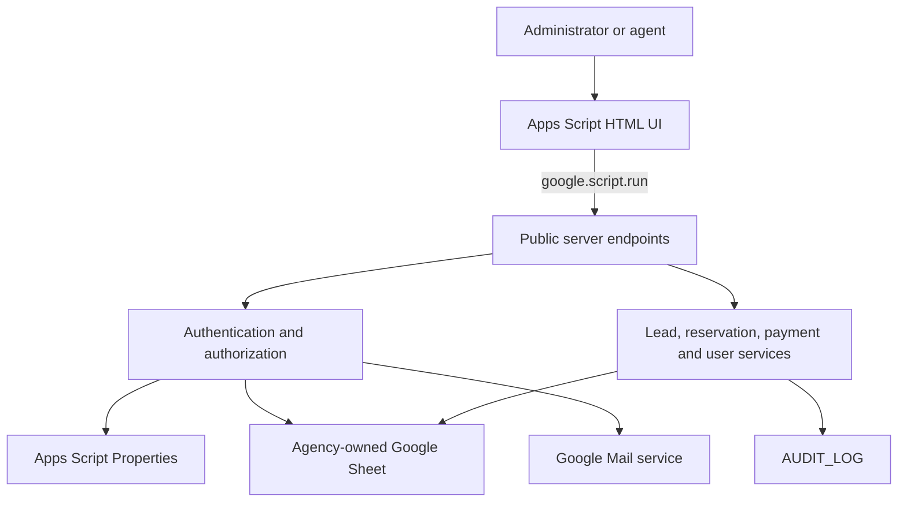
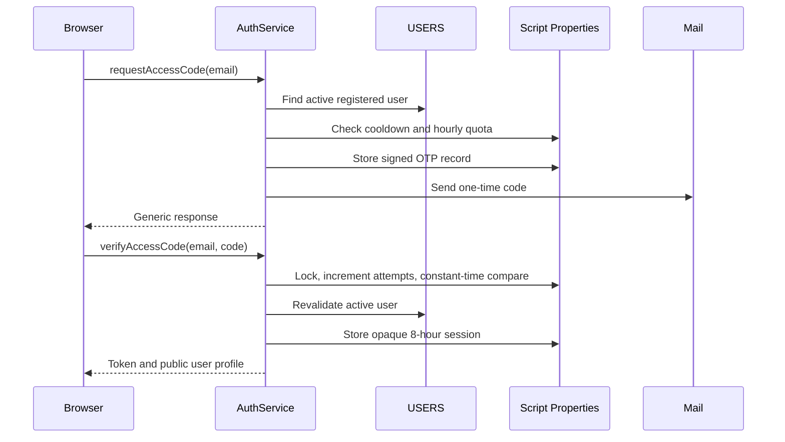
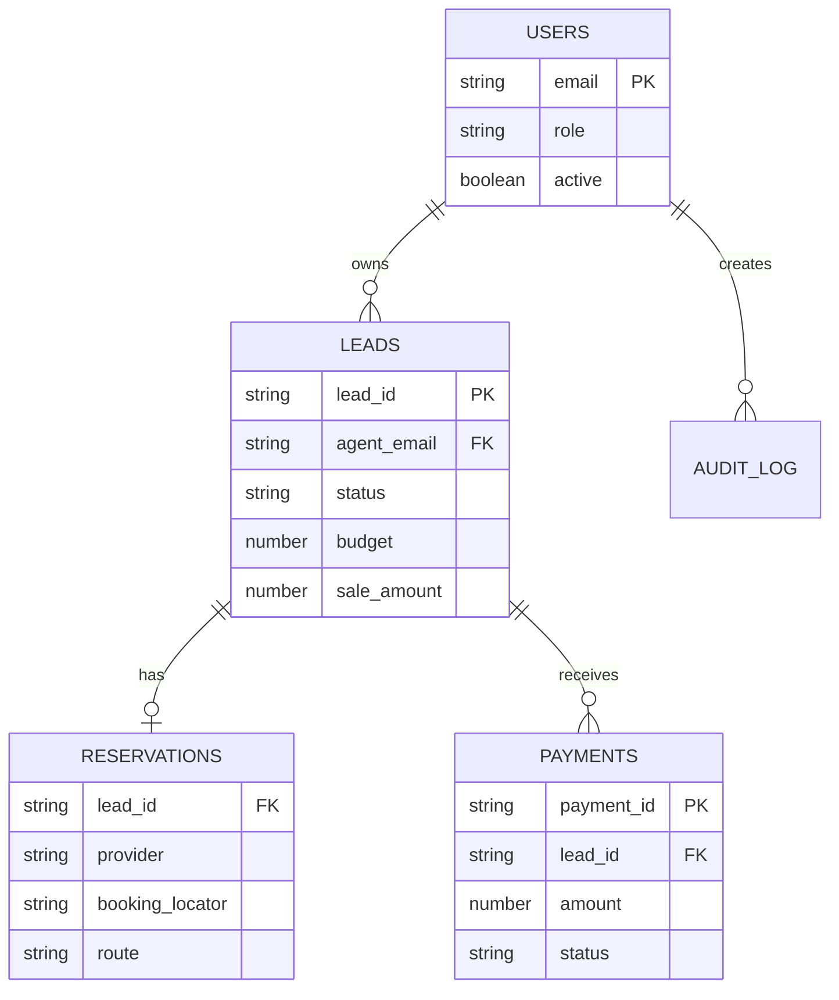

# Architecture

Open Travel CRM is a deliberately small, serverless system. Google Apps Script
hosts both the web application and the domain services; Google Sheets remains
the deployer's data store.

## System context

There is no browser-to-Sheets connection. The Web App executes as the deployment
owner, and every request is authorized by server code before data is read or
mutated.

## Source layout

| File | Responsibility |
| --- | --- |
| `Config.gs` | Constants, deployment configuration, parsing, date and lock helpers |
| `AuthService.gs` | OTP issuance, verification, rate limits, sessions and cleanup |
| `Security.gs` | User resolution, role/ownership enforcement, audit and signatures |
| `LeadsService.gs` | Dashboard, search, lead validation and ownership assignment |
| `ReservationsService.gs` | One-to-one reservation projection for each lead |
| `PaymentsService.gs` | Installments, totals, cancellations and status consistency |
| `AdminService.gs` | Administrator-only user lifecycle |
| `Setup.gs` | Idempotent installation, sheet formatting, schema checks and diagnostics |
| `WebApp.gs` | HTML entry point and authenticated bootstrap contract |
| `Index.html` | Dependency-free responsive client |

Apps Script loads `.gs` files into one global runtime. Private helpers and
manually invoked operational functions end with `_`; Apps Script therefore does
not expose them through `google.script.run`.

## Trust boundaries

The browser is untrusted. It can request an owner, role, lead ID, status or
payment amount, but the server:

1. resolves the opaque session through an HMAC-derived property key;
2. reloads the user from `USERS` and verifies that the account is active;
3. enforces the required role;
4. checks lead ownership for agents;
5. parses and validates domain input;
6. recalculates payment totals from the sheet;
7. performs mutations inside a `ScriptLock`;
8. appends a security-relevant audit record.

Changing browser HTML, JavaScript variables or API arguments cannot grant a
different role or lead owner.

## Authentication flow

Raw OTP values and session tokens are never stored. Property keys are derived
with an installation-specific HMAC secret. OTP responses are generic to reduce
account enumeration.

## Data model

Separate sheets keep the lead row compact and allow reservations and financial
movements to follow different retention rules. See the
[data dictionary](DATA_DICTIONARY.md) for the complete schema.

## Consistency model

Mutations use a script-level lock. This prevents concurrent requests from:

- allocating the same sequential lead ID;
- racing an OTP attempt or resend quota;
- editing the same payment from stale totals;
- deactivating the last active administrator;
- writing into the same free row.

Payments are the source of truth for collected value. After a payment changes,
the lead moves from `BOOKED_PENDING_PAYMENT` to `CLOSED_WON` when fully paid,
and back when a cancellation creates a balance. A lead total cannot be reduced
below its active collected payments.

## Schema lifecycle

`TRAVEL_CRM_SCHEMA_VERSION` records the installed schema. Normal requests fail
closed if code and schema versions differ. `setupTravelCrm_()` is idempotent for
a compatible installation and refuses to overwrite unexpected headers.

Future schema changes must include an explicit migration path and update the
[upgrading guide](UPGRADING.md). Silent column reordering is never acceptable.

## Scaling characteristics

Reads are batch-oriented where practical, but Sheets remains a spreadsheet:

- dashboard and search scan the accessible lead set;
- payment totals are grouped from one batch read;
- a single-lead view scans the payment sheet for that lead;
- Script Properties hold short-lived authentication records.

This architecture is a good fit for small teams and moderate lead volumes. If
execution latency, Apps Script quotas or concurrent writes become a regular
constraint, keep the UI and domain model but move persistence and authentication
to services designed for higher concurrency.

## Verification strategy

The repository runs three complementary test layers without production data:

- static contracts validate Apps Script/browser syntax, public endpoints,
  scopes and security invariants;
- pure unit checks exercise parsers, totals, signatures and configuration;
- an in-memory Apps Script integration harness runs OTP sign-in, user lifecycle,
  ownership isolation, lead writes, installments, cancellation, session
  invalidation, auditing and the health report against the real service code.

A disposable Apps Script deployment remains the recommended final acceptance
environment before a production release.

The manually approved `Apps Script staging` workflow makes that acceptance
repeatable. Its protected GitHub environment supplies the ignored project
binding, OAuth credentials and an installation-specific token. The remote
entry point fails closed unless the target declares itself as `staging`;
production never accepts remote health requests.

## Extension rules

Good integrations include quote emails, calendar follow-ups, Drive folders,
Looker Studio and webhook intake. Extensions should:

- keep secrets in Script Properties;
- validate inbound payloads on the server;
- make retries idempotent;
- write security-relevant actions to `AUDIT_LOG`;
- avoid granting agents direct spreadsheet access;
- add or update automated contract tests.
